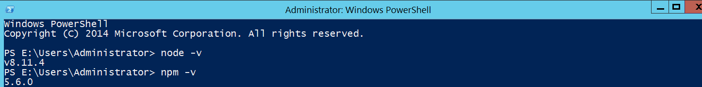
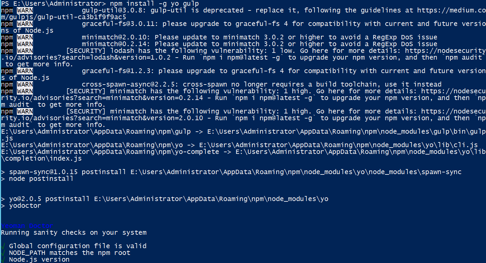
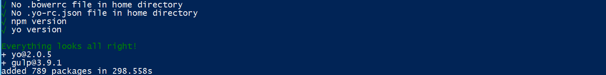
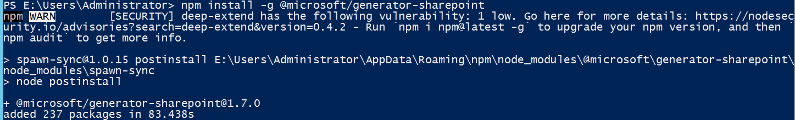

<p>&nbsp;</p>
<p>&nbsp;</p>
<p>&nbsp;</p>
<a name="top"></a>

<!-- omit in toc -->
# Prov.Overijssel

Location: [Scripts]
<!-- Markdown Header -->
      Workspace     : 
      Path          : D:\GitHub\Prov.Overijssel\README.md
      Author        : John Bontjer - ilionx - Management Consulting Noord 
      Created date  : 2022-07-06 


[??.. Niveau omhoog](../README.md)

<!-- omit in toc -->
# Introduction
>example layout from https://raw.githubusercontent.com/MicrosoftDocs/office-docs-powershell/master/sharepoint/sharepoint-ps/sharepoint-pnp/Get-PnPWorkflowDefinition.md


<!-- omit in toc -->
# Contents
- [](#)
- [Preparation](#preparation)
  - [Step #1: Install NodeJS for SharePoint Framework](#step-1-install-nodejs-for-sharepoint-framework)
  - [Step #2: Install Visual Studio Code](#step-2-install-visual-studio-code)
  - [Step #3: Install Yeoman and gulp](#step-3-install-yeoman-and-gulp)
    - [Install Gulp](#install-gulp)
    - [Install Yeoman](#install-yeoman)
  - [Step #4: Install Yeoman SharePoint Generator](#step-4-install-yeoman-sharepoint-generator)
  - [Step #4: Trusting the self-signed developer certificate](#step-4-trusting-the-self-signed-developer-certificate)
- [Develop SharePoint framework hello world web part](#develop-sharepoint-framework-hello-world-web-part)

---
[Top]

# Analyse rapport 

## Interviews

## 1.1.	Interviews
Om meer kennis op te doen van de omgeving hebben verschillende interviews plaatsgevonden. 
| Rol                       | Wie              | Kennisgebied                                                                    | Datum      |
| ------------------------- | ---------------- | ------------------------------------------------------------------------------- | ---------- |
| Projectleider             | Daan van Manen   | Kennismaking                                                                    | 11-07-2022 |
|                           | Eelco Herlé      | Project adviseur                                                                |            |
| Microsoft 365 consultant  | Jamal Alla       |                                                                                 |            |
|                           | Janneke          | Beide zijn functioneel verantwoordelijk<br>voor de inrichting van Microsoft 365 |            |
| Accountmanager SSC ONS    | Sytze de boer    | Infra, Netwerken                                                                | 11-07-2022 |
| Systeem Architect SSC ONS | Jan van der Werf |                                                                                 | 12-07-2022 |
| IT-architect              | Erik Zwaagman    |                                                                                 |            |
| Netwerkspecialist SSC ONS | Patrick Pater    |                                                                                 |            |

## Roxit enterprise

| Rol           | Wie | Kennisgebied | Datum |
| ------------- | --- | ------------ | ----- |
| Jan Timmerman |     | Zaaksysteem  |

## Swagger docs


Test omgeving ontvangen
-	https://inproces.acceptatie.webbergen
Inloggen via 
-	https://inproces.acceptatie.webbergen.nl/login?logintype=inproces
Swagger
-	https://inproces.acceptatie.webbergen.nl/home/swagger
 
Zaaktype Bezwaarschriften Zaaktypecode: B07... 
Zaaktype Bezwaarschriften
Zaaktypecode: B0756


## Uitleg On-premises gateway

Meerdere toepassings- en stroomverbindingen kunnen dezelfde gateway-installatie gebruiken.  De gateway-service maakt een uitgaande verbinding met Azure Service Bus, dus het is niet nodig om inkomende poorten open te houden. De uitgaande verbinding communiceert op de volgende poorten: TCP 443 (standaard), 5671, 5672, 9350 tot en met 9354. Aangeraden wordt de IP-adressen toe te voegen aan de goedkeuringslijst in de firewall.


## Bronnenlijst

1.	Bronnenlijst
Presenteer de bronnen in alfabetische volgorde met behulp van de APA Generator of de MLA Generator. 
Welke bronnen heb je gebruikt om dit Adviesrapport te schrijven?
Template
-	[Een perfect adviesrapport (met template en voorbeeld) (scribbr.nl)
OneNote](https://www.scribbr.nl/stage/schrijf-een-perfect-adviesrapport/)
-	Zie ook OneNote:[ M365 RX-Enterprise  (Web view)](onenote:https://bontjer.sharepoint.com/sites/provincieoverijssel/SiteAssets/Group Site Notitieblok/M365 RX-Enterprise.one#section-id={6CBCC235-A02B-4310-9416-50AF2BE17081}&end)
RX Enterpise/ Swagger
-	Zie ook OneNote: M365 RX-Enterprise  (Web view)
Gateways
-	[On-premises data gateways - Power Automate | Microsoft Docs](https://docs.microsoft.com/nl-nl/power-automate/gateway-reference)


# Preparation 
## Step #1: Install NodeJS for SharePoint Framework

- Done
  
---
[Top]

## Step #2: Install Visual Studio Code

To work with the SharePoint framework, next is we need to install a code editor.

Below are the Code Editors you can use for SharePoint framework development.

- Visual Studio Code
- Atom
- Webstorm

You can check how to [install visual studio code](https://www.enjoysharepoint.com/what-is-visual-studio-code/) step by step.

---
[Top]

## Step #3: Install Yeoman and gulp
Before installing the yeoman and gulp, check the “node” version and as well as the “npm” version of the SharePoint Framework (SPFx).

To check the version of node and npm version, Run the below command in your Windows PowerShell.

- **node -v** (check the node version)
- **npm -v** (check the npm version)



*sharepoint framework installation*

Yeoman helps to create kick-start a new project and yeoman generator helps to create a new web part in the SharePoint Framework.

Enter the following command to install Yeoman and gulp by using one command
```powershell
npm install -g yo gulp
```
Or individually, you can install the below commands:

### Install Gulp
```powershell
npm install gulp --location=global
```
> *npm WARN config global `--global`, `--local` are deprecated. Use `--location=global` instead.*


### Install Yeoman
```powershell
npm install yo --location=global
```
> *npm WARN config global `--global`, `--local` are deprecated. Use `--location=global` instead.*


You can enter this command by using your Windows PowerShell or NodeJS command prompt.

For installing the Yeoman and gulp, enter that above command in the Windows PowerShell. Then it will proceed like the below screenshot.






---
[Top]

## Step #4: Install Yeoman SharePoint Generator
Yeoman SharePoint Generator helps you to quickly create a SharePoint Client side solution project with the project structure in the SharePoint Framework.

Enter the following command to install Yeoman SharePoint Generator:

```powershell
npm install --location=global @microsoft/generator-sharepoint
```

For installing the Yeoman SharePoint Generator, enter that above command in the Windows PowerShell. Then it will proceed like below screenshot.


*install yeoman sharepoint generator*

>Note: You can install Gulp, Yeoman and Yeoman SharePoint Generator by using a single line command:

```powershell
npm install gulp yo @microsoft/generator-sharepoint --location=global
```

## Step #4: Trusting the self-signed developer certificate

You need to run the below command to trust the certificate after you develop the client side project. You can run in the same directory, using Windows PowerShell or NodeJS command prompt.

```powershell
gulp trust-dev-cert
```

> Note: You need to run the command only once in the development enviroment.

-----
[Top]

# Develop SharePoint framework hello world web part

Continue to [Develop SharePoint framework hello world web part][1]

[1]: docs/Develop-SharePoint-framework-hello-world-web-part.md


<!-- Hieronder staan de hidden referenties  --> 
<!-- ----------------------------- -->
[??.. Niveau omhoog]

[Niveau omhoog]: ../README.md
[??.. Niveau omhoog]: ../README.md
[Top]: #top

[Scripts]: ../README.md
[Patches]: ../README.md
[Lib]: ../README.md