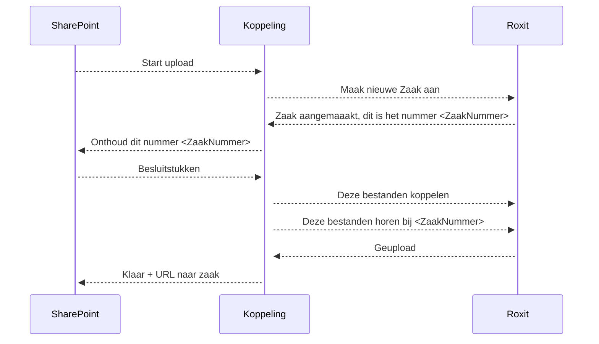

&nbsp;

&nbsp;

&nbsp;

<!-- omit in toc -->
# Sequence diagram

Location: [ScriDocspts]
<!-- Markdown Header -->
      Workspace     : Prov.Overijssel
      Path          : docs\sequenceDiagram.md
      Author        : John Bontjer - ilionx - Management Consulting Noord 
      Created date  : 2022-07-20 

[📁.. Niveau omhoog](../README.md)

-----
[Top]

<!-- Hieronder staan de hidden referenties  --> 
<!-- ----------------------------- -->
[📁.. Niveau omhoog]

[Niveau omhoog]: ../README.md
[📁.. Niveau omhoog]: ../README.md
[Top]: #top

[Scripts]: ../README.md
[Docs]: ../README.md
[Patches]: ../README.md
[Lib]: ../README.md